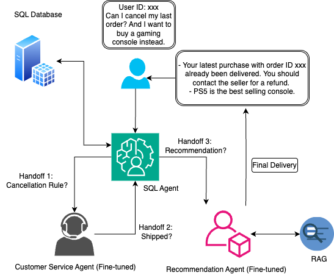

# E-commerce AI Agents Swarm

A multi-agent system for e-commerce customer support and product recommendations leveraging LLMs and vector search capabilities.

## Architecture



Unlike traditional supervisor architectures in multiagent system, our swarm allows agents to dynamically hand off control based on their specializations without central routing. It is really a decentralized practice where Handoffs are tools that return Command objects, telling exactly where to transfer control next. All agents share the same message state, ensuring conversation continuity. The fine-tuned Qwen 3-8B model is integrated as the retrieve_rules tool, giving the Customer Service Agent specialized e-commerce policy knowledge. Finally, every agent is able to decide when to deliver the final results.

## Installation

```bash
# Clone the repository
git clone https://github.com/sushiconcrete/ecommerce-AI-Agents-Swarm.git
cd ecommerce-AI-Agents-Swarm

# Setup virtual environment
python -m venv rag-llm
source rag-llm/bin/activate  # On Windows: rag-llm\Scripts\activate

# Install dependencies
pip install langchain langsmith langchainhub langchain_community langgraph langgraph_swarm
pip install langchain-openai tiktoken pandas duckduckgo-search qdrant_client
pip install unsloth sentencepiece protobuf datasets huggingface_hub hf_transfer
pip install grandalf ipywidgets
```

## Environment Setup

1. **API Keys Configuration**

Create a `.env` file with required API keys:
```
OPENAI_API_KEY=your_openai_api_key
LANGSMITH_API_KEY=your_langsmith_api_key
TAVILY_API_KEY=your_tavily_api_key
QDRANT_URL=your_qdrant_url
QDRANT_API_KEY=your_qdrant_api_key
```

2. **Load Fine-tuned Model**

```python
from unsloth import FastLanguageModel

model, tokenizer = FastLanguageModel.from_pretrained(
    model_name="path/to/merged_model",
    max_seq_length=2048,
    load_in_4bit=True,
)
```

3. **Database Configuration**

```python
from langchain_community.utilities import SQLDatabase
db = SQLDatabase.from_uri("sqlite:///path/to/mydatabase.db")
```

## Fine Tuning

Fine-tuning enhances the model's specialized e-commerce knowledge:

```python
# Fine-tune Qwen 3-8B for e-commerce policies and product knowledge
from unsloth import FastLanguageModel
import datasets

# Prepare dataset with e-commerce policies and product information
dataset = datasets.load_dataset("path/to/ecommerce_dataset")

# Initialize model for fine-tuning
model, tokenizer = FastLanguageModel.from_pretrained(
    model_name="Qwen/Qwen1.5-8B",
    max_seq_length=2048,
    load_in_4bit=True,
)

# Configure LoRA adapters
model = FastLanguageModel.get_peft_model(
    model,
    r = 32,           # Rank parameter
    target_modules = ["q_proj", "k_proj", "v_proj", "o_proj",
                      "gate_proj", "up_proj", "down_proj",],
    lora_alpha = 32,  # Alpha = rank
    lora_dropout = 0, # Optimized setting
    bias = "none",    # Optimized setting
    use_gradient_checkpointing = "unsloth", # 30% less VRAM
    random_state = 3407,
    use_rslora = False,
)

# Use SFTTrainer for efficient fine-tuning
from trl import SFTTrainer, SFTConfig
trainer = SFTTrainer(
    model = model,
    tokenizer = tokenizer,
    train_dataset = dataset["train"],
    eval_dataset = dataset["test"],
    args = SFTConfig(
        dataset_text_field = "text",
        per_device_train_batch_size = 2,
        gradient_accumulation_steps = 4,
        warmup_steps = 5,
        max_steps = 30,
        output_dir='outputs',
        eval_strategy="epoch",
        learning_rate = 2e-4,
        logging_steps = 1,
        optim = "adamw_8bit",
        weight_decay = 0.01,
        lr_scheduler_type = "linear",
        seed = 3407,
        report_to = "tensorboard",
    ),
)

# Train the model
trainer.train()

# Save fine-tuned model
model.save_pretrained("path/to/fine_tuned_model")
```

## Usage Examples

### Initialize Agent Swarm

```python
from langgraph.prebuilt import create_react_agent
from langgraph_swarm import create_handoff_tool, create_swarm
from langgraph.checkpoint.memory import MemorySaver

# Create agents with specialized tools
customer_service_agent = create_react_agent(
    model, 
    tools=customer_service_tools,
    name="Customer_Service_Agent",
    prompt="You are an Amazon helpful customer service representative."
)

recommender_agent = create_react_agent(
    model,
    tools=recommendation_tools,
    name="Recommender_agent",
    prompt="You are a product recommendation specialist."
)

sql_agent = create_react_agent(
    model,
    sql_tools,
    name="SQL_agent"
)

# Create the agent swarm
builder = create_swarm(
    [customer_service_agent, recommender_agent, sql_agent],
    default_active_agent="Customer_Service_Agent"
)

app = builder.compile(checkpointer=MemorySaver())
```

### Query the System

```python
import uuid

# Create config with unique thread ID
config = {"configurable": {"thread_id": str(uuid.uuid4()), "user_id": "1"}}

# Example query
response = app.invoke(
    {
        "messages": [
            {
                "role": "user",
                "content": "How can I cancel my recent order?"
            }
        ]
    },
    config
)

# Product recommendation with user ID
response = app.invoke(
    {
        "messages": [
            {
                "role": "user", 
                "content": "User id:e481f51cbdc54678b7cc49136f2d6af7. Can you recommend products based on my purchase history?"
            }
        ]
    },
    config
)
```

### Interactive UI

```python
# UI components
output = widgets.Output(layout=widgets.Layout(border='1px solid gray', padding='10px', height='400px', overflow='auto'))
text_input = widgets.Text(placeholder="Enter your message...", layout=widgets.Layout(width='80%'))
send_btn = widgets.Button(description="Send", button_style='primary')

# Send handler
config = {"configurable": {"thread_id": str(uuid.uuid4()), "user_id": "1"}}
def on_send(b):
    message = text_input.value.strip()
    if not message: return
    
    with output:
        output.clear_output()
        with tracing_v2_enabled(project_name="5293"):
            print_stream(app.stream({
                "messages": [{"role": "user", "content": message}]
            }, config, subgraphs=True))
    text_input.value = ""

send_btn.on_click(on_send)

# Display the UI
ui = widgets.VBox([output, widgets.HBox([text_input, send_btn])])
display(ui)
```

## Troubleshooting

### Model Loading Issues
- **CUDA out of memory**: Use `load_in_4bit=True` or reduce `max_seq_length`
- **Model not found**: Verify path is correct and accessible

### API Connection Errors
- **Authentication errors**: Check API keys in environment variables
- **Qdrant connection fails**: Verify URL, credentials, and collection existence

### Agent Communication Issues
- **Handoff failures**: Check handoff tool configuration and agent names
- **SQL query errors**: Verify database schema matches expected fields

### UI Issues
- **UI not displaying**: Ensure ipywidgets is installed
- **No agent responses**: Verify configurations and API keys

### Performance Issues
- **Slow responses**: Use background processing for long operations
- **High memory usage**: Unload models when not in use, reduce context length 